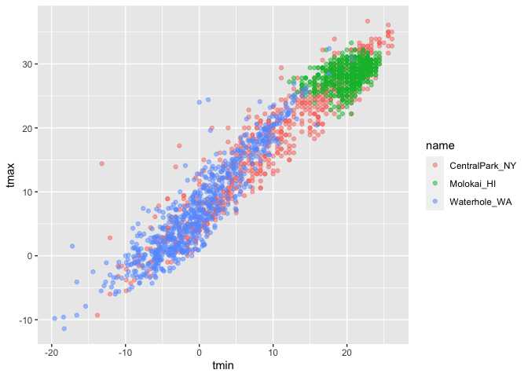
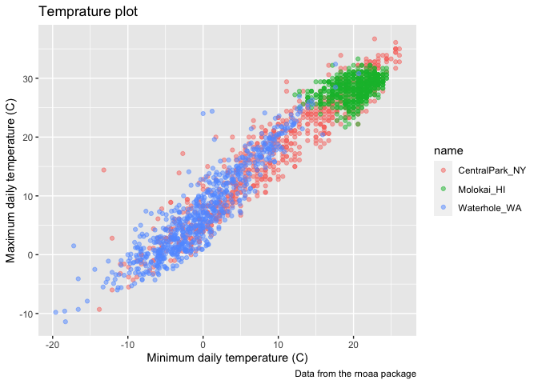
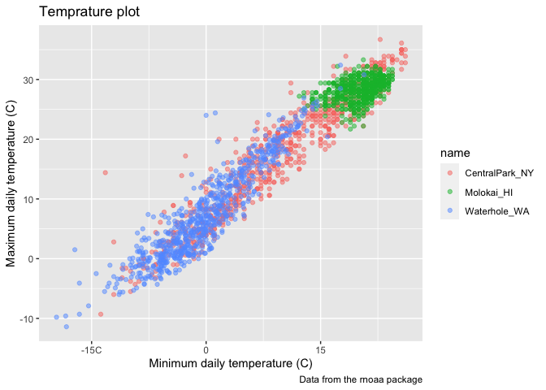
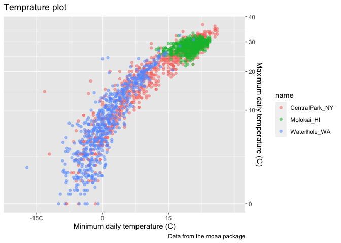
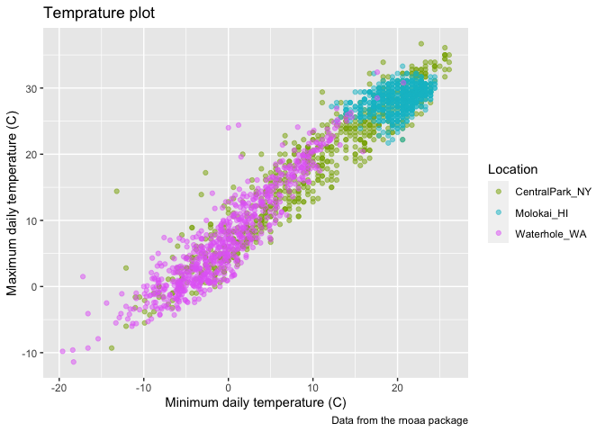
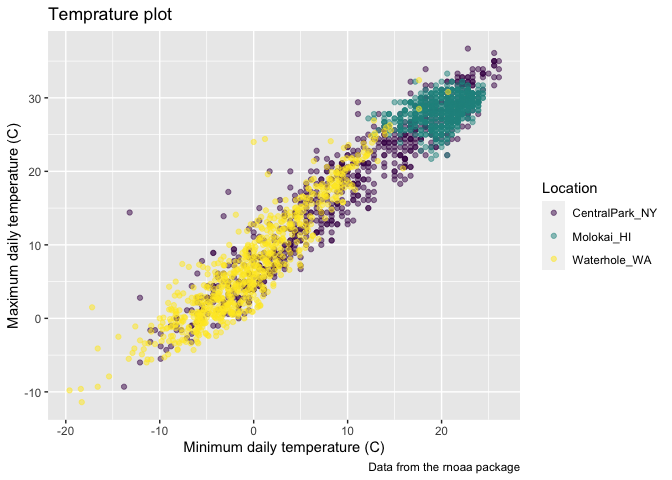
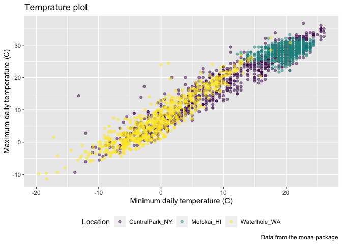
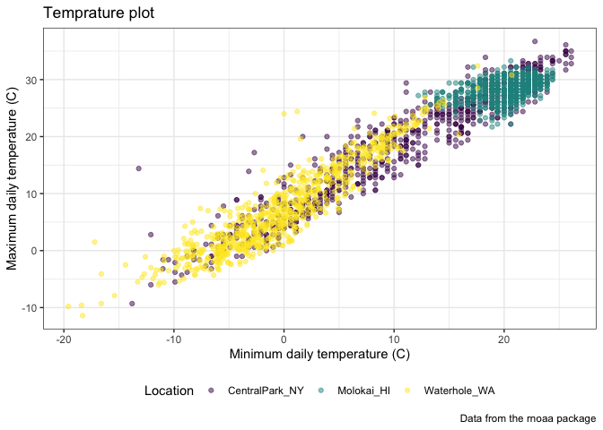
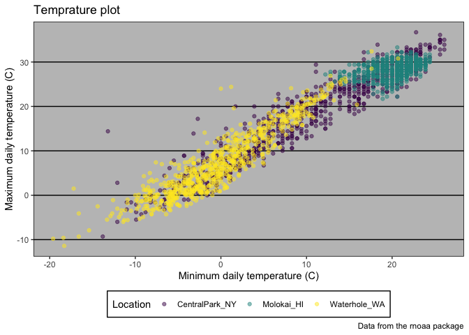
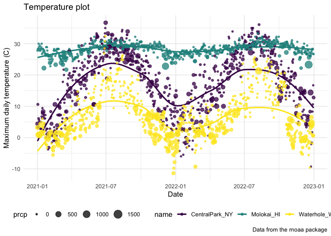

viz_part2
================
Eunsuh Cho
2023-10-03

Loading the necessary packages

``` r
library(tidyverse)
```

    ## ── Attaching core tidyverse packages ──────────────────────── tidyverse 2.0.0 ──
    ## ✔ dplyr     1.1.3     ✔ readr     2.1.4
    ## ✔ forcats   1.0.0     ✔ stringr   1.5.0
    ## ✔ ggplot2   3.4.3     ✔ tibble    3.2.1
    ## ✔ lubridate 1.9.2     ✔ tidyr     1.3.0
    ## ✔ purrr     1.0.2     
    ## ── Conflicts ────────────────────────────────────────── tidyverse_conflicts() ──
    ## ✖ dplyr::filter() masks stats::filter()
    ## ✖ dplyr::lag()    masks stats::lag()
    ## ℹ Use the conflicted package (<http://conflicted.r-lib.org/>) to force all conflicts to become errors

``` r
library(patchwork)
```

Loading the NOAA weather data using last week’s code

``` r
weather_df = 
  rnoaa::meteo_pull_monitors(
    c("USW00094728", "USW00022534", "USS0023B17S"),
    var = c("PRCP", "TMIN", "TMAX"), 
    date_min = "2021-01-01",
    date_max = "2022-12-31") |>
  mutate(
    name = recode(
      id, 
      USW00094728 = "CentralPark_NY", 
      USW00022534 = "Molokai_HI",
      USS0023B17S = "Waterhole_WA"),
    tmin = tmin / 10,
    tmax = tmax / 10) |>
  select(name, id, everything())
```

    ## using cached file: /Users/irenecho/Library/Caches/org.R-project.R/R/rnoaa/noaa_ghcnd/USW00094728.dly

    ## date created (size, mb): 2023-09-28 10:20:05.358275 (8.524)

    ## file min/max dates: 1869-01-01 / 2023-09-30

    ## using cached file: /Users/irenecho/Library/Caches/org.R-project.R/R/rnoaa/noaa_ghcnd/USW00022534.dly

    ## date created (size, mb): 2023-09-28 10:20:10.51322 (3.83)

    ## file min/max dates: 1949-10-01 / 2023-09-30

    ## using cached file: /Users/irenecho/Library/Caches/org.R-project.R/R/rnoaa/noaa_ghcnd/USS0023B17S.dly

    ## date created (size, mb): 2023-09-28 10:20:12.329849 (0.994)

    ## file min/max dates: 1999-09-01 / 2023-09-30

``` r
weather_df
```

    ## # A tibble: 2,190 × 6
    ##    name           id          date        prcp  tmax  tmin
    ##    <chr>          <chr>       <date>     <dbl> <dbl> <dbl>
    ##  1 CentralPark_NY USW00094728 2021-01-01   157   4.4   0.6
    ##  2 CentralPark_NY USW00094728 2021-01-02    13  10.6   2.2
    ##  3 CentralPark_NY USW00094728 2021-01-03    56   3.3   1.1
    ##  4 CentralPark_NY USW00094728 2021-01-04     5   6.1   1.7
    ##  5 CentralPark_NY USW00094728 2021-01-05     0   5.6   2.2
    ##  6 CentralPark_NY USW00094728 2021-01-06     0   5     1.1
    ##  7 CentralPark_NY USW00094728 2021-01-07     0   5    -1  
    ##  8 CentralPark_NY USW00094728 2021-01-08     0   2.8  -2.7
    ##  9 CentralPark_NY USW00094728 2021-01-09     0   2.8  -4.3
    ## 10 CentralPark_NY USW00094728 2021-01-10     0   5    -1.6
    ## # ℹ 2,180 more rows

Scatterplot - tmax against tmin

``` r
weather_df |> 
  ggplot(aes(x = tmin, y = tmax)) +
  geom_point(aes(color = name), alpha = .5)
```

    ## Warning: Removed 17 rows containing missing values (`geom_point()`).

<!-- -->

Labels

``` r
weather_df |> 
  ggplot(aes(x = tmin, y = tmax)) +
  geom_point(aes(color = name), alpha = .5) +
  labs(
    title = "Temprature plot",
    x = "Minimum daily temperature (C)",
    y = "Maximum daily temperature (C)",
    caption = "Data from the rnoaa package"
  )
```

    ## Warning: Removed 17 rows containing missing values (`geom_point()`).

<!-- -->

Scales

``` r
weather_df |> 
  ggplot(aes(x = tmin, y = tmax)) +
  geom_point(aes(color = name), alpha = .5) +
  labs(
    title = "Temprature plot",
    x = "Minimum daily temperature (C)",
    y = "Maximum daily temperature (C)",
    caption = "Data from the rnoaa package") +
  scale_x_continuous(
    breaks = c(-15, 0, 15),
    labels = c("-15C", "0", "15"))
```

    ## Warning: Removed 17 rows containing missing values (`geom_point()`).

<!-- -->

Other `scale_x_*` and `scale_y_*` options

``` r
weather_df |> 
  ggplot(aes(x = tmin, y = tmax)) +
  geom_point(aes(color = name), alpha = .5) +
  labs(
    title = "Temprature plot",
    x = "Minimum daily temperature (C)",
    y = "Maximum daily temperature (C)",
    caption = "Data from the rnoaa package") +
  scale_x_continuous(
    breaks = c(-15, 0, 15),
    labels = c("-15C", "0", "15"),
    limits = c(-20, 30)) +
  scale_y_continuous(
    trans = "sqrt",
    position = "right")
```

    ## Warning in self$trans$transform(x): NaNs produced

    ## Warning: Transformation introduced infinite values in continuous y-axis

    ## Warning: Removed 142 rows containing missing values (`geom_point()`).

<!-- -->
`scale_y_sqrt()` can transform the Y scale, and `xlim()` can control X
axis plot limits.

Controlling `color` aesthetic using `scale`s

``` r
weather_df |> 
  ggplot(aes(x = tmin, y = tmax)) +
  geom_point(aes(color = name), alpha = .5) +
  labs(
    title = "Temprature plot",
    x = "Minimum daily temperature (C)",
    y = "Maximum daily temperature (C)",
    caption = "Data from the rnoaa package") +
  scale_color_hue(name = "Location", h = c(100, 300))
```

    ## Warning: Removed 17 rows containing missing values (`geom_point()`).

<!-- -->

Using `viridis` package

``` r
ggp_temp_plot =
weather_df |> 
  ggplot(aes(x = tmin, y = tmax)) +
  geom_point(aes(color = name), alpha = .5) +
  labs(
    title = "Temprature plot",
    x = "Minimum daily temperature (C)",
    y = "Maximum daily temperature (C)",
    caption = "Data from the rnoaa package") +
  viridis::scale_color_viridis(
    name = "Location",
    discrete = TRUE
  )

ggp_temp_plot
```

    ## Warning: Removed 17 rows containing missing values (`geom_point()`).

<!-- --> We used
`discrete = TRUE` bceause the `color` aesthetic is mapped to a discrete
variable!

Themes

`theme_gray`

``` r
ggp_temp_plot +
  theme(legend.position = "bottom")
```

    ## Warning: Removed 17 rows containing missing values (`geom_point()`).

<!-- -->

`theme_bw()`

``` r
ggp_temp_plot +
  theme_bw() +
  theme(legend.position = "bottom")
```

    ## Warning: Removed 17 rows containing missing values (`geom_point()`).

<!-- -->

`theme_classic()`

``` r
ggp_temp_plot +
  theme_classic() +
  theme(legend.position = "bottom")
```

    ## Warning: Removed 17 rows containing missing values (`geom_point()`).

<!-- -->

lol excel 2003 theme

``` r
ggp_temp_plot +
  ggthemes::theme_excel() +
  theme(legend.position = "bottom")
```

    ## Warning: Removed 17 rows containing missing values (`geom_point()`).

<!-- -->

Learning assessment

``` r
weather_df |> 
  ggplot(aes(x = date, y = tmax, color = name)) +
  geom_smooth(se = FALSE) +
  geom_point(aes(size = prcp), alpha = .75) +
  labs(
    title = "Temperature plot",
    x = "Date",
    y = "Maximum daily temperature (C)",
    caption = "Data from the rnoaa package") +
  viridis::scale_color_viridis(discrete = TRUE) +
  theme_minimal() +
  theme(legend.position = "bottom")
```

    ## `geom_smooth()` using method = 'loess' and formula = 'y ~ x'

    ## Warning: Removed 17 rows containing non-finite values (`stat_smooth()`).

    ## Warning: Removed 19 rows containing missing values (`geom_point()`).

<!-- -->
